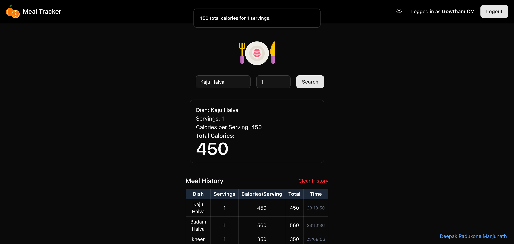

# 🍽️ Meal Calorie Tracker

A simple, responsive web application to search and log meals with their calorie information. Built using **Next.js**, **Tailwind CSS**, and **ShadCN UI**, this app supports theme switching, guarded routes, and backend API integration.

---

## ✨ Features

- 🔐 Authentication with login/register flow
- 🔎 Meal search using external API
- 📊 Total calorie calculation
- 🕓 Meal history log (in-memory or extendable to backend)
- 🌗 Theme toggle (dark/light) with persistence
- 🧪 Tests with Vitest + React Testing Library
- 🚫 Guarded routes (dashboard access only after login)
- 🐳 Dockerized dev environment
- 🔍 SEO-friendly meta tags

---

## 📸 Screenshots

> _(Replace the following with real screenshots as needed)_

1. **Login Page**

   

2. **Dashboard + Meal Search**

   

3. **Calorie Result + Meal History**

   

---

## 🛠️ Setup Instructions

### 1. Clone the repo

```bash
git clone https://github.com/deepakpadukone20/meal-calorie-frontend-deepak.git
cd meal-calorie-frontend-deepak
```

```bash
git clone https://github.com/deepakpadukone20/meal-calorie-backend-deepak-.git
cd meal-calorie-backend-deepak-
```

### 2. Install dependencies on both projects

```bash
npm install
```

### 3. Environment variables

Create a `.env` file - frontend:

```env
NEXT_PUBLIC_API_BASE_URL=http://localhost:8000
```
Create a `.env` file - backend:

```env
PORT=8000
USDA_API_KEY=??
PG_URI=??
JWT_SECRET=??
```

### 4. Run the backend app

```bash
node server.js
```
### 5. Run the frontend app

```bash
npm run dev
```

Visit: [http://localhost:3000](http://localhost:3000)

---

## 🧪 Running Tests

```bash
npm run test
```

Uses **Vitest** and **@testing-library/react** to test form interactions and results display.

---

## 🐳 Dockerized Dev Environment

To run the app in a container:

```bash
docker-compose up --build
```

Make sure `Dockerfile` and `docker-compose.yml` are configured in the root.

---

## 🧠 Design Decisions & Trade-offs

- **In-memory meal history**: For simplicity, meal history is temporarily stored in client memory. To persist, integrate localStorage or backend DB.
- **Minimal UI/UX**: Built with developer-first focus using `ShadCN UI` and `Tailwind`.
- **Authentication**: Few Bugs exists like manual navigation even when valid JWT token exists
- **Testing**: Covers Meal Search and Result components. Coverage for guards and login can be added.

---

## 📁 Folder Structure

```
/components         # UI Components (MealSearch, ResultCard, etc.)
/stores             # Zustand store for auth state
/lib                # Utilities (withAuthGuard)
/app                # App directory with pages and layout
```

---

## 📦 Tech Stack

- [Next.js 14+ (App Router)](https://nextjs.org)
- [Tailwind CSS](https://tailwindcss.com)
- [ShadCN UI + Sonner](https://ui.shadcn.com)
- [Zustand](https://zustand-demo.pmnd.rs/)
- [Vitest](https://vitest.dev)
- [Docker](https://www.docker.com)

---
## 📦 Deployed on Vercel & Railway

- [Frontend - Vercel](https://meal-calorie-frontend-deepak.vercel.app/)
- [Backend - Railway](https://meal-calorie-backend-deepak-production.up.railway.app/)

---
## 📜 License

MIT License

---

## 👨‍💻 Author

Built with by [Deepak](https://www.deepakpadukone.com)


